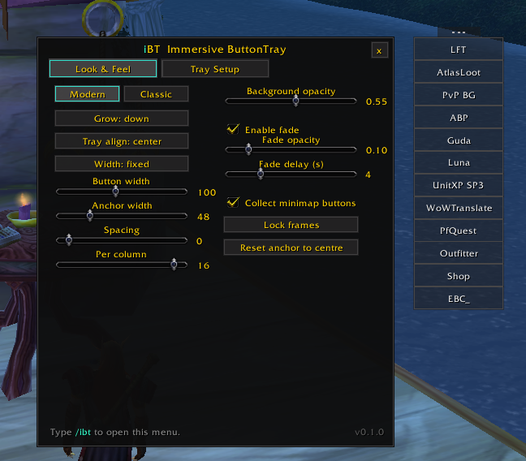
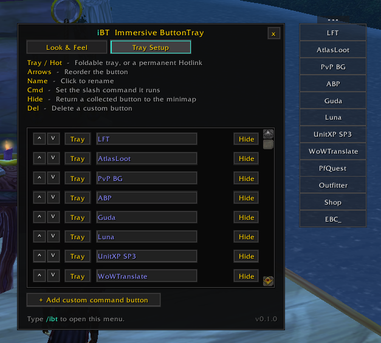

# Immersive ButtonTray

**A tidy launcher dock for vanilla WoW 1.12 — sweep your addon minimap buttons into one clean tray, and add your own buttons that run any command.**

Minimap buttons pile up and clutter the edge of the map (especially with a square minimap). Immersive ButtonTray collects them all into one simple, text-based menu that stays out of the way and fades when you don't need it — and lets you add your own buttons for the commands you actually use.

## What it does

- **Collects your minimap buttons** — every addon button off the minimap, gathered into one place as clean text.
- **Custom command buttons** — make your own button that runs a slash command (like `/luna` or your favourite macro), so you don't have to remember them.
- **Two lists in one dock:**
  - **Hotlinks** — always visible, for the things you reach for constantly.
  - **Tray** — a foldable menu that opens on click and tucks away when you're done.
- **Fades when idle** — the whole dock quietly fades out after a few seconds, and comes back when your mouse is near. Keeps your screen clean and the world in focus.
- **Your layout** — grow up or down, set the width, spacing, columns, opacity, and alignment.
- **Modern or Classic theme.**

## Install

1. Download the ZIP from the [latest release](../../releases/latest) and unpack it.
2. Put the `ImmersiveButtonTray` folder into your `Interface\AddOns\` folder.
3. Restart the game.

If you used the green **Code → Download ZIP** button, rename the unpacked `ImmersiveButtonTray-main` folder to just `ImmersiveButtonTray`, or the game won't load it.

## Using it

- Type **`/ibt`** (or right-click the dock handle) to open the options.
- **Left-click the handle** to open or close the Tray. **Drag it** to move the whole dock (unlock first with `/ibt unlock`).
- In **Tray Setup**, put each button in the **Tray** or **Hotlinks**, rename it, reorder it, or add your own command button.
- In **Look & Feel**, set the theme, layout, and how the dock fades.

## Credits & license

The minimap-button collection is adapted from **pfUI**'s addon-button module (MIT, © Shagu). Everything else is original. Released under the MIT license.
